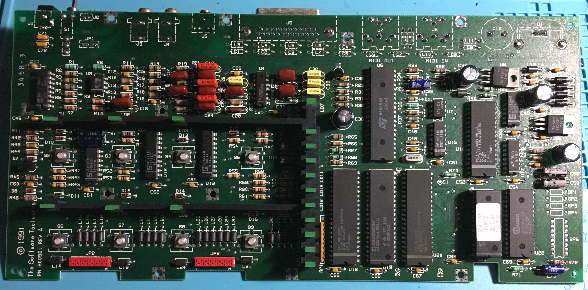
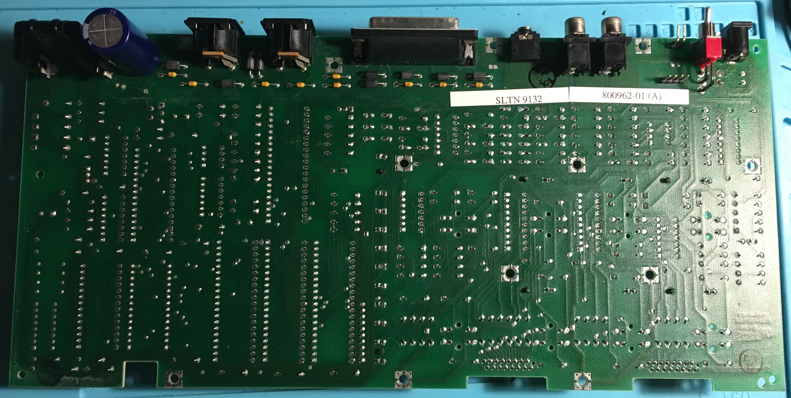
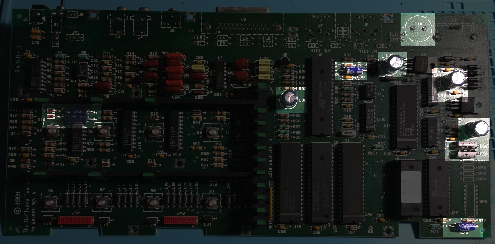
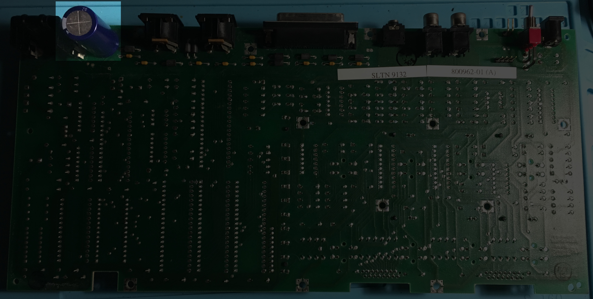

# miracle-piano-specs
Technical information about the Miracle Piano Teaching System from The Software Toolworks

## External documentation

- [Wikipedia page](https://en.wikipedia.org/wiki/Miracle_Piano_Teaching_System)
- [Miracle Piano software, documentation and serial cable pinout](http://pianoeducation.org/pnompcab.html)
- [Another FAQ (racketboy)](http://www.racketboy.com/forum/viewtopic.php?p=588444) (includes serial cable pinout for the NES with diagrams and photos)
- [Repair video #1 (Taylor Helm)](https://www.youtube.com/watch?v=90LaH4nD_Us), [Repair video #2 (8-bit Keys)](https://www.youtube.com/watch?v=fXMY-XLa8s0)

## Board

## Capacitors replacement

Capacitor | Values | Form factor
------------ | ------------- | -------------
C10 | 6800 µF 16V | radial
C36 | 220 µF 16V | radial
C38 | 10 µF 25V | axial
C39 | 220 µF 16V | radial
C42 | 220 µF 16V | radial
C46 | 22 µF 10V | axial
C47 | 22 µF 10V | axial
C56 | 220 µF 16V | radial
C58 | 4.7 µF 5V | axial
C59 | 4.7 µF 5V | axial
C70 | 10 µF 25V | axial

## License

See [license file](LICENSE)
